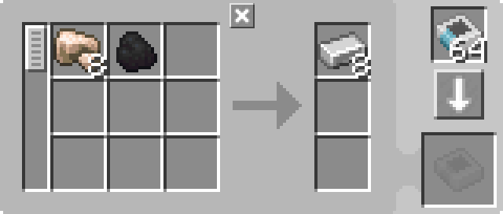

---
navigation:
  parent: example-setups/example-setups-index.md
  title: 熔炉自动化
  icon: minecraft:furnace
---

# 熔炉自动化

由于使用了<ItemLink id="pattern_provider" />，本设计意在接入你的[自动合成](../ae2-mechanics/autocrafting.md)体系。若只想单独自动化熔炉，用漏斗、箱子之类即可。

自动化<ItemLink id="minecraft:furnace" />比[充能器](../example-setups/charger-automation.md)这类简单机器略麻烦：熔炉需要两个不同侧面进料，再从第三个面抽出产物。待烧物品须从顶面送入，燃料须从侧面送入，成品须从底面取出。

也可以在顶面放<ItemLink id="pattern_provider" />、侧面放<ItemLink id="export_bus" />持续推入燃料、底面放<ItemLink id="import_bus" />把结果导入网络——但这样会占用 3 条[频道](../ae2-mechanics/channels.md)。

下面只用 1 条频道即可实现：

<GameScene zoom="6" interactive={true}>
  <ImportStructure src="../assets/assemblies/furnace_automation.snbt" />

<BoxAnnotation color="#dddddd" min="1 0 0" max="2 1 1">
        （1）样板供应器：用赛特斯石英扳手调成方向型，装有相应的处理样板。

        
  </BoxAnnotation>

<BoxAnnotation color="#dddddd" min="1 1 0" max="2 1.3 1">
        （2）接口：默认配置。
  </BoxAnnotation>

<BoxAnnotation color="#dddddd" min="1 1 0" max="1.3 2 1">
        （3）存储总线 #1：过滤煤炭。
        <ItemImage id="minecraft:coal" scale="2" />
  </BoxAnnotation>

<BoxAnnotation color="#dddddd" min="0 2 0" max="1 2.3 1">
        （4）存储总线 #2：使用<ItemLink id="inverter_card" />将煤炭列入黑名单。
        <Row><ItemImage id="minecraft:coal" scale="2" /><ItemImage id="inverter_card" scale="2" /></Row>
  </BoxAnnotation>

<DiamondAnnotation pos="4 0.5 0.5" color="#00ff00">
        至主网络
    </DiamondAnnotation>

  <IsometricCamera yaw="195" pitch="30" />
</GameScene>

## 配置

* <ItemLink id="pattern_provider" />（1）为默认配置，装有相应的<ItemLink id="processing_pattern" />；用<ItemLink id="certus_quartz_wrench" />可将其设为方向型。

  

* <ItemLink id="interface" />（2）为默认配置。
* 第一个<ItemLink id="storage_bus" />（3）过滤煤炭（或你选用的任意燃料）。
* 第二个<ItemLink id="storage_bus" />（4）用<ItemLink id="inverter_card" />把所用燃料列入黑名单。

## 工作原理

1. <ItemLink id="pattern_provider" />把原料推入<ItemLink id="interface" />。（作为优化，它也会直接经由存储总线推送，就好像这些总线是供应器各面的延伸；物品并不会真正进入接口。）
2. 接口设为不存储任何物品，因而会把原料继续推入[网络存储](../ae2-mechanics/import-export-storage.md)。
3. 绿色子网上仅有<ItemLink id="storage_bus" />作为存储。过滤煤炭的总线从侧面把煤炭送进燃料槽；过滤「非煤炭」的总线从顶面把待烧物品送进原料槽。
4. 熔炉照常烧炼。
5. 漏斗从熔炉底面取出成品，放进供应器的返还格，从而回到主网络。
