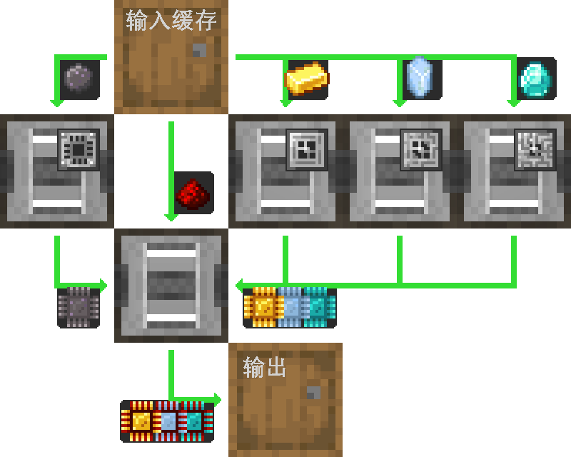
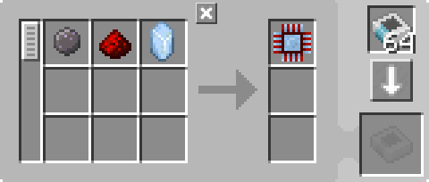

---
navigation:
  parent: example-setups/example-setups-index.md
  title: 处理器自动化
  icon: logic_processor
---

# 自动化生产处理器

自动化[处理器](../items-blocks-machines/processors.md)有多种方式，如下是其一。

此通用设计也可用任意种类的物流管道、导管、管道或其他不同称呼的同类装置完成，仅要求这些管道能设置过滤。

下文说明如何仅用 AE2 实现，其中会用到[「管道」子网](pipe-subnet.md)。

由于使用了<ItemLink id="pattern_provider" />，本设计意在接入你的[自动合成](../ae2-mechanics/autocrafting.md)体系。若只想单独自动化处理器，把样板供应器换成另一只木桶，并把原料直接放进上方木桶即可。

这一设计恰好可与旧版 AE2 兼容：即便<ItemLink id="inscriber" />是面敏感的，管道子网仍能从正确的侧面插入与抽取。

## 样板编码的教训

通常情况下，你真正需要的[样板](../items-blocks-machines/patterns.md)，与 **JEI 里看到的配方**，或是按下「+」按钮时自动生成的配方，**并不一致**。在本例中，JEI 会生成 2 个样板：其一用于制造电路板，其二用于最终组装；且第一个样板里还会塞进一枚[压印模板](../items-blocks-machines/presses.md)。这显然不符合本设施的设计思路。我们只需要 **1 个**处理样板：从原材料到已压印完成的处理器；压印模板既已常驻压印器中，就不应再出现在样板里。

---

<GameScene zoom="4" interactive={true}>
  <ImportStructure src="../assets/assemblies/processor_automation.snbt" />

  <BoxAnnotation color="#dddddd" min="5 1 0" max="6 2 1" thickness=".05">
        （1）样板供应器：默认配置，装有相关处理样板。

        <Row>
            
            
            
        </Row>
  </BoxAnnotation>

  <BoxAnnotation color="#dddddd" min="4.7 2 0" max="5 3 1" thickness=".05">
        （2）存储总线#1：默认配置。
  </BoxAnnotation>

  <BoxAnnotation color="#dddddd" min="4 1 0" max="4.3 2 1" thickness=".05">
        （3）输出总线#1：过滤硅，装有2张加速卡。
        <Row><ItemImage id="silicon" scale="2" /> <ItemImage id="speed_card" scale="2" /></Row>
  </BoxAnnotation>

  <BoxAnnotation color="#dddddd" min="4 4 0" max="4.3 3 1" thickness=".05">
        （4）输出总线#2：过滤金锭，装有2张加速卡。
        <Row><ItemImage id="minecraft:gold_ingot" scale="2" /> <ItemImage id="speed_card" scale="2" /></Row>
  </BoxAnnotation>

  <BoxAnnotation color="#dddddd" min="4 5 0" max="4.3 4 1" thickness=".05">
        （5）输出总线#3：过滤赛特斯石英水晶，装有2张加速卡。
        <Row><ItemImage id="certus_quartz_crystal" scale="2" /> <ItemImage id="speed_card" scale="2" /></Row>
  </BoxAnnotation>

  <BoxAnnotation color="#dddddd" min="4 6 0" max="4.3 5 1" thickness=".05">
        （6）输出总线#4：过滤钻石，装有2张加速卡。
        <Row><ItemImage id="minecraft:diamond" scale="2" /> <ItemImage id="speed_card" scale="2" /></Row>
  </BoxAnnotation>

  <BoxAnnotation color="#dddddd" min="2.3 3 0" max="2 2 1" thickness=".05">
        （7）输出总线#5：过滤红石粉，装有2张加速卡。
        <Row><ItemImage id="minecraft:redstone" scale="2" /> <ItemImage id="speed_card" scale="2" /></Row>
  </BoxAnnotation>

  <BoxAnnotation color="#dddddd" min="4 1 0" max="3 2 1" thickness=".05">
        （8）压印器#1：默认配置。装有硅压印模板和4张加速卡。
        <Row><ItemImage id="silicon_press" scale="2" /> <ItemImage id="speed_card" scale="2" /></Row>
  </BoxAnnotation>

  <BoxAnnotation color="#dddddd" min="4 3 0" max="3 4 1" thickness=".05">
        （9）压印器#2：默认配置。装有逻辑压印模板和4张加速卡。
        <Row><ItemImage id="logic_processor_press" scale="2" /> <ItemImage id="speed_card" scale="2" /></Row>
  </BoxAnnotation>

  <BoxAnnotation color="#dddddd" min="4 4 0" max="3 5 1" thickness=".05">
        （10）压印器#3：默认配置。装有计算压印模板和4张加速卡。
        <Row><ItemImage id="calculation_processor_press" scale="2" /> <ItemImage id="speed_card" scale="2" /></Row>
  </BoxAnnotation>

  <BoxAnnotation color="#dddddd" min="4 5 0" max="3 6 1" thickness=".05">
        （11）压印器#4：默认配置。装有工程压印模板和4张加速卡。
        <Row><ItemImage id="engineering_processor_press" scale="2" /> <ItemImage id="speed_card" scale="2" /></Row>
  </BoxAnnotation>

  <BoxAnnotation color="#dddddd" min="2 2 0" max="1 3 1" thickness=".05">
        （12）压印器#5：默认配置。装有4张加速卡。
        <ItemImage id="speed_card" scale="2" />
  </BoxAnnotation>

  <BoxAnnotation color="#dddddd" min="2.7 2 0" max="3 1 1" thickness=".05">
        （13）输入总线#1：默认配置，装有2张加速卡。
        <ItemImage id="speed_card" scale="2" />
  </BoxAnnotation>

  <BoxAnnotation color="#dddddd" min="2.7 4 0" max="3 3 1" thickness=".05">
        （14）输入总线#2：默认配置，装有2张加速卡。
        <ItemImage id="speed_card" scale="2" />
  </BoxAnnotation>

  <BoxAnnotation color="#dddddd" min="2.7 5 0" max="3 4 1" thickness=".05">
        （15）输入总线#3：默认配置，装有2张加速卡。
        <ItemImage id="speed_card" scale="2" />
  </BoxAnnotation>

  <BoxAnnotation color="#dddddd" min="2.7 6 0" max="3 5 1" thickness=".05">
        （16）输入总线#4：默认配置，装有2张加速卡。
        <ItemImage id="speed_card" scale="2" />
  </BoxAnnotation>

  <BoxAnnotation color="#dddddd" min="2 3 0" max="1 3.3 1" thickness=".05">
        （17）存储总线#2：默认配置。
  </BoxAnnotation>

  <BoxAnnotation color="#dddddd" min="2 1.7 0" max="1 2 1" thickness=".05">
        （18）存储总线#3：默认配置。
  </BoxAnnotation>

  <BoxAnnotation color="#dddddd" min="1 2 0" max="0.7 3 1" thickness=".05">
        （19）输入总线#5：默认配置，装有2张加速卡。
        <ItemImage id="speed_card" scale="2" />
  </BoxAnnotation>

  <BoxAnnotation color="#dddddd" min="5 0.7 0" max="6 1 1" thickness=".05">
        （20）存储总线#4：默认配置。
  </BoxAnnotation>

<BoxAnnotation color="#dddddd" min="3.3 2.7 0.3" max="3.7 3 0.7" thickness=".05">
        石英纤维为压印器供电；压印器会像线缆一样传递能量。
  </BoxAnnotation>

<DiamondAnnotation pos="7 1.5 0.5" color="#00ff00">
        至主网络
    </DiamondAnnotation>

  <IsometricCamera yaw="185" pitch="5" />
</GameScene>

## 配置

* <ItemLink id="pattern_provider" />（1）为默认配置，装有相应的<ItemLink id="processing_pattern" />。

  
  
  

* 编号为 2、17、18、20 的<ItemLink id="storage_bus" />为默认配置。
* 编号为 3–7 的<ItemLink id="export_bus" />按对应原料过滤；装有 2 张<ItemLink id="speed_card" />。
    <Row>
      <ItemImage id="silicon" scale="2" />
      <ItemImage id="minecraft:gold_ingot" scale="2" />
      <ItemImage id="certus_quartz_crystal" scale="2" />
      <ItemImage id="minecraft:diamond" scale="2" />
      <ItemImage id="minecraft:redstone" scale="2" />
    </Row>
* 编号为 13–16、19 的<ItemLink id="import_bus" />为默认配置；装有 2 张<ItemLink id="speed_card" />。
* <ItemLink id="inscriber" />为默认配置，装有相应的[压印模板](../items-blocks-machines/presses.md)与 4 张<ItemLink id="speed_card" />。
   <Row>
     <ItemImage id="silicon_press" scale="2" />
     <ItemImage id="logic_processor_press" scale="2" />
     <ItemImage id="calculation_processor_press" scale="2" />
     <ItemImage id="engineering_processor_press" scale="2" />
   </Row>

## 工作原理

1. <ItemLink id="pattern_provider" />将原料推入木桶。
2. 第一个[管道子网](pipe-subnet.md)（橙色）从木桶中抽出硅、红石粉，以及当前处理器配方所需的原料（金锭、赛特斯石英水晶或钻石），并送入对应的<ItemLink id="inscriber" />。
3. 前四台<ItemLink id="inscriber" />制造<ItemLink id="printed_silicon" />，以及<ItemLink id="printed_logic_processor" />、<ItemLink id="printed_calculation_processor" />或<ItemLink id="printed_engineering_processor" />。
4. 第二个与第三个[管道子网](pipe-subnet.md)（绿色）从前四台<ItemLink id="inscriber" />取出已印刷的电路板，送入第五台、用于最终组装的<ItemLink id="inscriber" />。
5. 第五台<ItemLink id="inscriber" />组装[处理器](../items-blocks-machines/processors.md)。
6. 第四个[管道子网](pipe-subnet.md)（紫色）把处理器送进样板供应器，从而回到主网络。