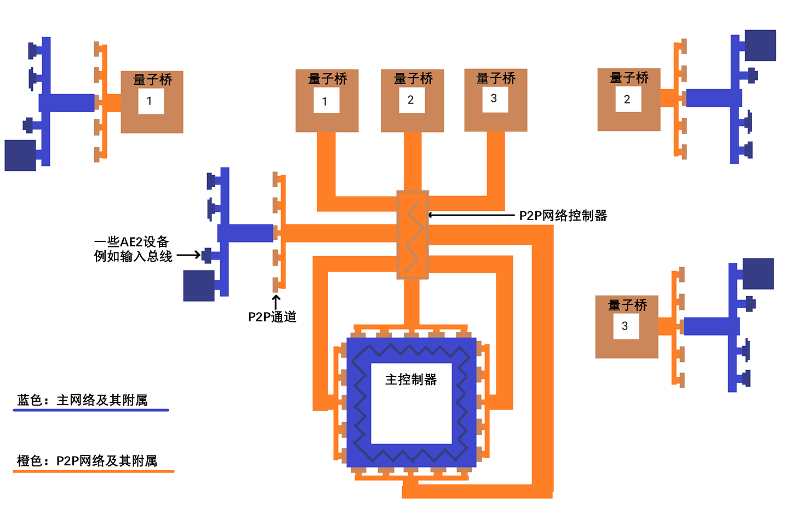

---
navigation:
  parent: items-blocks-machines/items-blocks-machines-index.md
  title: P2P通道
  icon: me_p2p_tunnel
  position: 210
categories:
- devices
item_ids:
- ae2:me_p2p_tunnel
- ae2:redstone_p2p_tunnel
- ae2:item_p2p_tunnel
- ae2:fluid_p2p_tunnel
- ae2:fe_p2p_tunnel
- ae2:light_p2p_tunnel
---

# P2P通道

<GameScene zoom="6" background="transparent">
  <ImportStructure src="../assets/assemblies/p2p_tunnels.snbt" />
  <IsometricCamera yaw="195" pitch="30" />
</GameScene>

P2P通道是在网络中传输物品、流体、红石信号、能量、光、[频道](../ae2-mechanics/channels.md)等内容的一种方式，且不必直接与网络交互。P2P 通道有多种变种，每种只能传输一类内容。可将它们看作远距离直接连接两方块的“传送门”。这种连接有明确的输入端与输出端，并非双向。

例如，朝向物品 P2P 通道的漏斗，与直接朝向木桶的漏斗行为一致，物品都能正常传输。

<GameScene zoom="4" background="transparent">
  <ImportStructure src="../assets/assemblies/p2p_hopper_barrel.snbt" />
  <IsometricCamera yaw="195" pitch="30" />
</GameScene>

但是，相邻放置的两个木桶不会互相传输物品。

<GameScene zoom="4" background="transparent">
  <ImportStructure src="../assets/assemblies/p2p_barrel_barrel.snbt" />
  <IsometricCamera yaw="195" pitch="30" />
</GameScene>

其他类型也同理，例如红石 P2P 通道。

<GameScene zoom="4" background="transparent">
  <ImportStructure src="../assets/assemblies/p2p_redstone.snbt" />
  <IsometricCamera yaw="195" pitch="30" />
</GameScene>

## P2P通道的类型与调谐

<GameScene zoom="6" background="transparent">
  <ImportStructure src="../assets/assemblies/p2p_tunnels.snbt" />
  <IsometricCamera yaw="180" pitch="90" />
</GameScene>

P2P 通道有多种类型，其中只有 ME P2P 通道可直接合成；其他类型需要手持对应物品右击任意 P2P 通道进行调谐：
- ME P2P 通道需手持任意[线缆](../items-blocks-machines/cables.md)右击调谐
- 红石 P2P 通道需手持红石元件右击调谐
- 物品 P2P 通道需手持箱子或漏斗右击调谐
- 流体 P2P 通道需手持铁桶或玻璃瓶右击调谐
- 能源 P2P 通道需手持能量容器右击调谐
- 光 P2P 通道需手持火把或荧石右击调谐

某些 P2P 通道有特殊限制。例如，ME P2P 通道的频道无法穿过其他 ME P2P 通道；能源 P2P 通道则会因自身[能量](../ae2-mechanics/energy.md)损耗而扣除通过能量的 5%（FE、E）。

## P2P通道的最常见用途

P2P 通道的最常见用途便是通过 ME P2P 通道以高效传输[频道](../ae2-mechanics/channels.md)。传输大量频道不再需要一束致密线缆，一根致密线缆就已足够。

在此示例中，8 个 ME P2P 通道输入端会从主网络的 <ItemLink id="controller" /> 传出 256（8×32）个频道，另外 8 个 ME P2P 输出端再把这些频道送往其他位置。注意每个 P2P 通道输入端和输出端都只占用 1 个频道。这样就能在单根线缆中传输大量频道。又因为 P2P 通道位于专用[子网](../ae2-mechanics/subnetworks.md)中，它们甚至不会占用主网络频道！此外，P2P 通道可直接面向控制器放置，也可在两者间放入[致密线缆](../items-blocks-machines/cables.md#smart-cable)来可视化传输频道。

<GameScene zoom="4" interactive={true}>
  <ImportStructure src="../assets/assemblies/p2p_compact_channels.snbt" />

  <BoxAnnotation color="#dddddd" min="1.3 1.3 6.3" max="2 2.7 6.7">
        石英纤维会在主网络和 P2P 子网间传输能量。
  </BoxAnnotation>

  <IsometricCamera yaw="225" pitch="30" />
</GameScene>

另一种用法（与[量子桥](quantum_bridge.md)联用）见下图示意：

## 嵌套

但是，这一系统无法在单根线缆中传输无限频道。ME P2P 通道的频道无法穿过其他 ME P2P 通道，也因此无法嵌套它们。注意位于外层红色线缆上的 ME P2P 通道处于离线状态。这一性质仅适用于 ME P2P 通道；其他种类的 P2P 通道则可穿过 ME P2P 通道，如此连接的红石 P2P 通道能正常工作。

<GameScene zoom="4" background="transparent">
  <ImportStructure src="../assets/assemblies/p2p_nesting.snbt" />
  <IsometricCamera yaw="225" pitch="30" />
</GameScene>

## 连接

<GameScene zoom="6" background="transparent">
  <ImportStructure src="../assets/assemblies/p2p_linking_frequency.snbt" />
  <IsometricCamera yaw="195" pitch="30" />
</GameScene>

P2P 通道连接可用 <ItemLink id="memory_card" /> 创建。连接频率会在 P2P 通道背面显示为 2×2 的颜色阵列。
- 按住潜行并右击以生成新的 P2P 连接频率。
- 右击以粘贴设置或升级卡，或连接频率。

按住潜行并右击的通道为输入端，右击的通道为输出端。允许存在多个输出端，但 ME P2P 通道传输的频道会分给各输出端，而非每个输出端都获得全部频道，如此可避免频道被复制。

## 配方

<RecipeFor id="me_p2p_tunnel" />