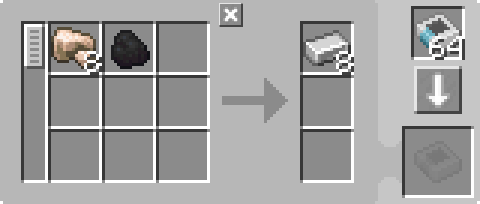

---
navigation:
  parent: items-blocks-machines/items-blocks-machines-index.md
  title: 样板供应器
  icon: pattern_provider
  position: 210
categories:
- devices
item_ids:
- ae2:pattern_provider
- ae2:cable_pattern_provider
---

# 样板供应器

<Row gap="20">
<BlockImage id="pattern_provider" scale="8" />
<BlockImage id="pattern_provider" p:push_direction="up" scale="8" />
<GameScene zoom="8" background="transparent">
  <ImportStructure src="../assets/blocks/cable_pattern_provider.snbt" />
</GameScene>
</Row>

样板供应器是[自动合成](../ae2-mechanics/autocrafting.md)系统与世界交互的核心方式。它会把[样板](patterns.md)定义的材料推送到相邻容器；同时也可以向供应器输入物品，将其送入网络。实际搭建中，常可把机器产物回传到附近的样板供应器（通常就是当初负责投料的那台），从而省去一个 <ItemLink id="import_bus" /> 频道。

需要注意：样板供应器是直接从合成 CPU 的[合成存储器](crafting_cpu_multiblock.md#crafting-storage)中取料并推送的，它自身库存并不会真正缓存这批材料。因此你不能直接从供应器“抽出材料”；应先让供应器把料推到其他容器（例如木桶），再从那个容器抽取。

另一个关键点是：供应器必须一次推送完整批次，不能“半批”发送。这个特性在自动化设计中非常有用。

样板供应器与[子网](../ae2-mechanics/subnetworks.md)上的接口有特殊交互：如果接口保持默认状态（请求槽为空），供应器会跳过接口，直接输出到该子网的[网络存储](../ae2-mechanics/import-export-storage.md)。这样既不会把接口塞满配方批次，也会在目标机器空间不足时暂停下一批投料。该行为与阻挡模式配合时效果正确：供应器会监测机器槽位，而不是接口槽位。

例如，下方设施会把“待烧炼物”与“燃料”分别直接送入熔炉对应槽位。可利用此特性向单台机器的多个面，或向多台机器并行供料。

<GameScene zoom="6" background="transparent">
  <ImportStructure src="../assets/assemblies/furnace_automation.snbt" />

<BoxAnnotation color="#dddddd" min="1 0 0" max="2 1 1">
        （1）样板供应器：使用赛特斯石英扳手切换为方向型，并装入对应处理样板。

        
  </BoxAnnotation>

<BoxAnnotation color="#dddddd" min="1 1 0" max="2 1.3 1">
        （2）接口：默认配置。
  </BoxAnnotation>

<BoxAnnotation color="#dddddd" min="1 1 0" max="1.3 2 1">
        （3）存储总线 #1：过滤为煤炭。
        <ItemImage id="minecraft:coal" scale="2" />
  </BoxAnnotation>

<BoxAnnotation color="#dddddd" min="0 2 0" max="1 2.3 1">
        （4）存储总线 #2：用反相卡设为“排除煤炭”。
        <Row><ItemImage id="minecraft:coal" scale="2" /><ItemImage id="inverter_card" scale="2" /></Row>
  </BoxAnnotation>

<DiamondAnnotation pos="4 0.5 0.5" color="#00ff00">
        至主网络
    </DiamondAnnotation>

  <IsometricCamera yaw="195" pitch="30" />
</GameScene>

下面是“向多台机器供料”的通用结构示意：

<GameScene zoom="6" background="transparent">
<ImportStructure src="../assets/assemblies/provider_interface_storage.snbt" />

<BoxAnnotation color="#dddddd" min="2.7 0 1" max="3 1 2">
        接口（必须为面板型，不可用方块型）
  </BoxAnnotation>

<BoxAnnotation color="#dddddd" min="1 0 0" max="1.3 1 4">
        存储总线
  </BoxAnnotation>

<BoxAnnotation color="#dddddd" min="0 0 0" max="1 1 4">
        需要接收样板供料的位置
  </BoxAnnotation>

<IsometricCamera yaw="185" pitch="30" />
</GameScene>

支持多个带相同样板的样板供应器并行工作。

样板供应器会尽量把批次轮询分配到各个面，从而并行利用所有相邻机器。

## 变种

样板供应器有 3 种变种：普通、方向、面板/[子部件](../ae2-mechanics/cable-subparts.md)。不同变种会影响“向哪些面推送材料、从哪些面接收物品、在哪些面提供网络连接”。

*   普通样板供应器会向所有面推料、从所有面收料，并像大多数 AE2 机器一样向所有面提供网络连接。

*   方向型样板供应器可对普通样板供应器使用 <ItemLink id="certus_quartz_wrench" /> 切换得到。它只向选中面推料、从所有面收料，并且选中面不提供网络连接。这样就能向 AE2 机器投料而不把网络直接连通，适合构建子网。

*   面板样板供应器属于[线缆子部件](../ae2-mechanics/cable-subparts.md)，可在同一线缆上放置多个，便于紧凑布局。其行为类似方向型的选中面：可供样板、可接收输入，且该面**不**提供网络连接。

样板供应器可在普通与面板形态间通过合成方格互相转换。

## 设置

样板供应器支持多种模式：

*   **阻挡模式**：当机器中已有材料时，阻止继续推送新批次。
*   **锁定合成**：可在多种红石条件下锁定供应器，或直到上一批产物返回该供应器后解锁。
*   可在 <ItemLink id="pattern_access_terminal" /> 中设置供应器显示/隐藏。

## 优先级

可点击 GUI 右上角扳手设置优先级。当多个[样板](patterns.md)都可产出同一物品时，会优先使用高优先级供应器中的样板；除非网络无法提供该高优先级样板所需材料。

## 常见误解

很多人会把样板供应器和输出总线混着用，导致布局看起来“像能工作”，实际却不行。常见误区是把线缆当作物品管道。正如[线缆](cables.md)页所述，线缆没有内部库存，样板供应器不会向线缆里推物品。

<GameScene zoom="8" background="transparent">
  <ImportStructure src="../assets/assemblies/provider_misconception_1.snbt" />

  <BoxAnnotation color="#dddddd" min="1 0 3" max="2 1 4">
        不是高炉
  </BoxAnnotation>

  <IsometricCamera yaw="95" pitch="5" />
</GameScene>

在这种布局中，供应器没有有效输出目标，因此不会正常运作。它在这里只是“充当线缆”，把 <ItemLink id="export_bus" /> 连上网络。

供应器也不会“告诉”输出总线该导出什么；输出总线只会按自身过滤槽配置导出。

上面那个错误布局本质上等价于下图：

<GameScene zoom="8" background="transparent">
  <ImportStructure src="../assets/assemblies/provider_misconception_2.snbt" />

  <BoxAnnotation color="#dddddd" min="1 0 3" max="2 1 4">
        不是高炉
  </BoxAnnotation>

  <IsometricCamera yaw="95" pitch="5" />
</GameScene>

你真正想要的通常是下面这种：样板供应器直接把样板所需材料推给相邻机器。

<GameScene zoom="8" background="transparent">
  <ImportStructure src="../assets/assemblies/provider_misconception_3.snbt" />

  <BoxAnnotation color="#dddddd" min="1 0 3" max="2 1 4">
        不是高炉
  </BoxAnnotation>

  <IsometricCamera yaw="95" pitch="5" />
</GameScene>

## 配方

<RecipeFor id="pattern_provider" />

<RecipeFor id="cable_pattern_provider" />
